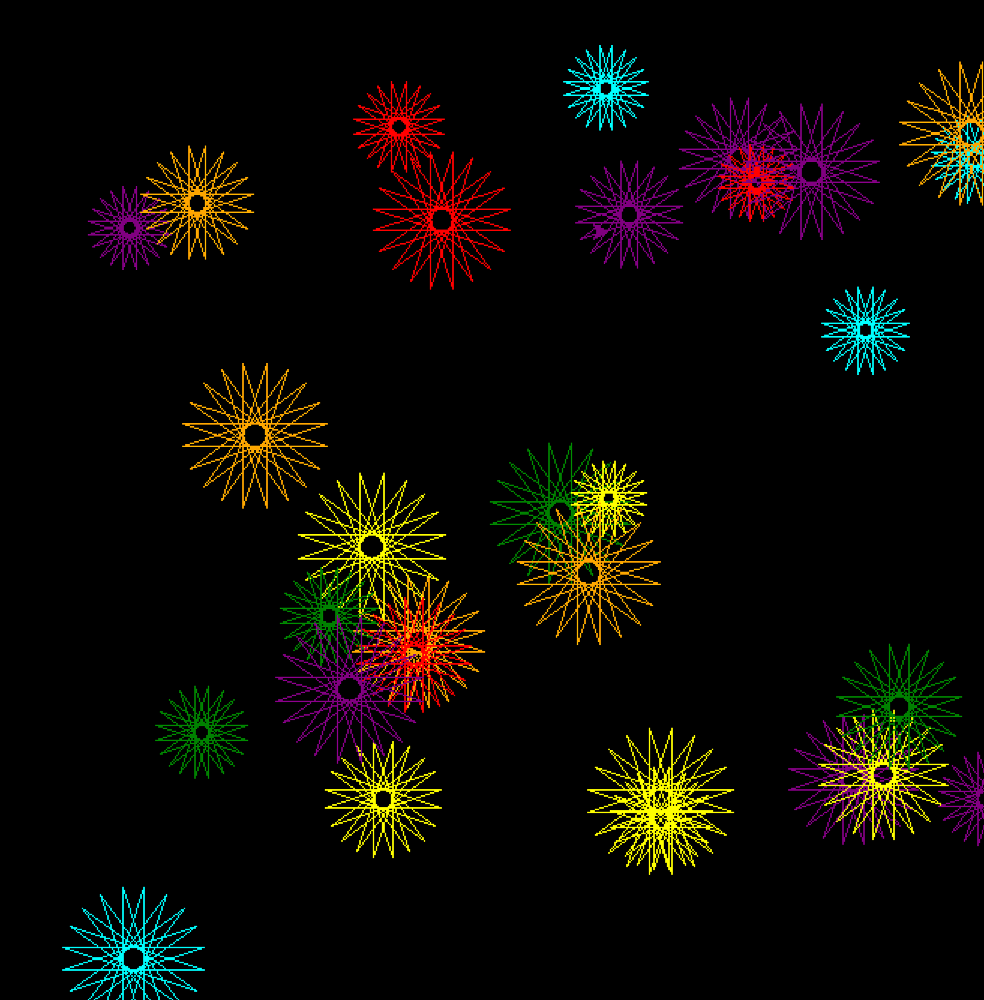

# Fireworks with Turtle - Python Creative Coding

## Description

This project uses the Python `turtle` library to generate a
digital fireworks animation.

The program creates colorful fireworks by drawing shapes at
random positions over a black background, demonstrating how
simple programming instructions can become a visual artwork.

This project explores the relationship between:

- Programming
- Mathematics
- Digital Art
- Generative Visualization

## Educational Purpose

This project is part of my digital art and creative coding
portfolio.

It demonstrates how Python can be used as a creative tool to
produce visual experiences through algorithms and computational
processes.

Students can study how code controls:

- Position
- Movement
- Colors
- Shapes
- Repetition
- Random generation

## Technologies Used

- Python
- Turtle Graphics Library

## How to Run

This project must be executed locally using a Python environment.

Recommended environments:

- Visual Studio Code
- PyCharm
- Python Console

Steps:

1. Install Python.
2. Download or clone this repository.
3. Open the file:

4. Run the script.

The animation will be generated automatically in a Python window.

## Project Status

Currently under development.

Future improvements may include:

- More complex particle effects
- User interaction
- Sound integration
- Additional visual experiments

## Project Category

Creative Coding  
Generative Digital Art  
Python Visualization  
Computational Art Experiment

## Author

Gloria Martinez

Part of a personal digital art and programming portfolio.

## Licencia Este repositorio está bajo la licencia Creative Commons Attribution-NonCommercial-NoDerivatives 4.0 International (CC BY-NC-ND 4.0). 

## Créditos Este proyecto incluye código adaptado del tutorial "Python Fireworks" del canal eeprogrammer en YouTube. 
El propósito es mostrar mi aprendizaje y adaptación, no reclamar autoría original.

